#DIAMOND:

How many observations and how many variables in the diamonds dataset?
53940 - 10
How many order factors in the variables?

```r
library(ggplot2)
```

```
## Need help? Try the ggplot2 mailing list:
## http://groups.google.com/group/ggplot2.
```

```r
data(diamonds)
summary(diamonds)
```

```
##      carat               cut        color        clarity     
##  Min.   :0.2000   Fair     : 1610   D: 6775   SI1    :13065  
##  1st Qu.:0.4000   Good     : 4906   E: 9797   VS2    :12258  
##  Median :0.7000   Very Good:12082   F: 9542   SI2    : 9194  
##  Mean   :0.7979   Premium  :13791   G:11292   VS1    : 8171  
##  3rd Qu.:1.0400   Ideal    :21551   H: 8304   VVS2   : 5066  
##  Max.   :5.0100                     I: 5422   VVS1   : 3655  
##                                     J: 2808   (Other): 2531  
##      depth           table           price             x         
##  Min.   :43.00   Min.   :43.00   Min.   :  326   Min.   : 0.000  
##  1st Qu.:61.00   1st Qu.:56.00   1st Qu.:  950   1st Qu.: 4.710  
##  Median :61.80   Median :57.00   Median : 2401   Median : 5.700  
##  Mean   :61.75   Mean   :57.46   Mean   : 3933   Mean   : 5.731  
##  3rd Qu.:62.50   3rd Qu.:59.00   3rd Qu.: 5324   3rd Qu.: 6.540  
##  Max.   :79.00   Max.   :95.00   Max.   :18823   Max.   :10.740  
##                                                                  
##        y                z         
##  Min.   : 0.000   Min.   : 0.000  
##  1st Qu.: 4.720   1st Qu.: 2.910  
##  Median : 5.710   Median : 3.530  
##  Mean   : 5.735   Mean   : 3.539  
##  3rd Qu.: 6.540   3rd Qu.: 4.040  
##  Max.   :58.900   Max.   :31.800  
## 
```

```r
str(diamonds)
```

```
## Classes 'tbl_df', 'tbl' and 'data.frame':	53940 obs. of  10 variables:
##  $ carat  : num  0.23 0.21 0.23 0.29 0.31 0.24 0.24 0.26 0.22 0.23 ...
##  $ cut    : Ord.factor w/ 5 levels "Fair"<"Good"<..: 5 4 2 4 2 3 3 3 1 3 ...
##  $ color  : Ord.factor w/ 7 levels "D"<"E"<"F"<"G"<..: 2 2 2 6 7 7 6 5 2 5 ...
##  $ clarity: Ord.factor w/ 8 levels "I1"<"SI2"<"SI1"<..: 2 3 5 4 2 6 7 3 4 5 ...
##  $ depth  : num  61.5 59.8 56.9 62.4 63.3 62.8 62.3 61.9 65.1 59.4 ...
##  $ table  : num  55 61 65 58 58 57 57 55 61 61 ...
##  $ price  : int  326 326 327 334 335 336 336 337 337 338 ...
##  $ x      : num  3.95 3.89 4.05 4.2 4.34 3.94 3.95 4.07 3.87 4 ...
##  $ y      : num  3.98 3.84 4.07 4.23 4.35 3.96 3.98 4.11 3.78 4.05 ...
##  $ z      : num  2.43 2.31 2.31 2.63 2.75 2.48 2.47 2.53 2.49 2.39 ...
```
what letters represents the best diamond?

```r
levels(diamonds$color)
```

```
## [1] "D" "E" "F" "G" "H" "I" "J"
```

#Price Histogram:
Create a histogram of the price of all the diamonds in the diamond data set.


```r
library(ggthemes) 
#theme_set(theme_minimal(24)) 
qplot(x = price, data = diamonds)
```

```
## `stat_bin()` using `bins = 30`. Pick better value with `binwidth`.
```

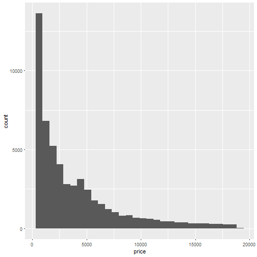
long-tailed distribution.
#Price Histogram Summary:
Describe the shape and center of the price distribution. Include summary statistics like mean and median


```r
summary(diamonds$price)
```

```
##    Min. 1st Qu.  Median    Mean 3rd Qu.    Max. 
##     326     950    2401    3933    5324   18820
```

# Diamond Counts:
How many diamonds cost less than $500,250 or more than 15000

```r
sum(diamonds$price < 500)
```

```
## [1] 1729
```

```r
sum(diamonds$price <250)
```

```
## [1] 0
```

```r
sum(diamonds$price>=15000)
```

```
## [1] 1656
```
# Cheaper Diamonds:
Explore the largest peak in the price histogram you created earlier.
Try limiting the x-axis, altering the bin width, and setting different breaks on the x-axis.

```r
qplot(x = price, data = diamonds)
```

```
## `stat_bin()` using `bins = 30`. Pick better value with `binwidth`.
```


```r
qplot(x = price, data = diamonds, xlim = c(0,2500), binwidth = 1)
```

```
## Warning: Removed 26398 rows containing non-finite values (stat_bin).
```

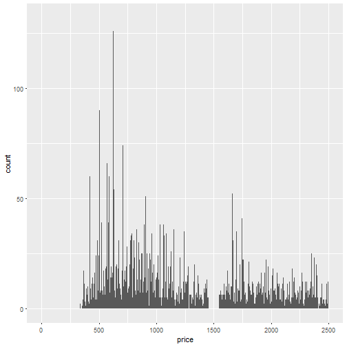

```r
qplot(x = price, data = diamonds, xlim = c(0,2500), binwidth = 200)
```

```
## Warning: Removed 26398 rows containing non-finite values (stat_bin).
```

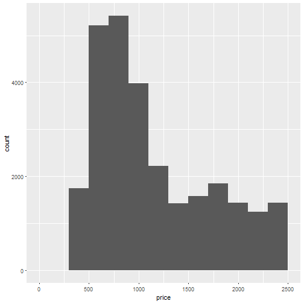

```r
qplot(x = price, data = diamonds, xlim = c(0,2500), binwidth = 500)
```

```
## Warning: Removed 26398 rows containing non-finite values (stat_bin).
```

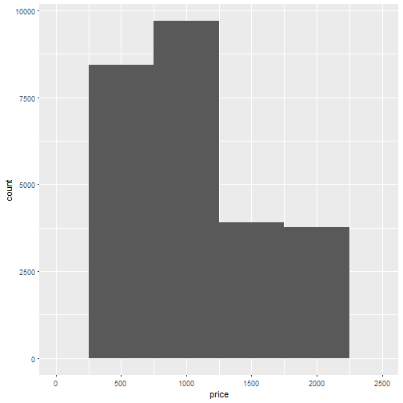

```r
ggsave('priceHistogram.png')
```

```
## Saving 7 x 7 in image
```

```
## Warning: Removed 26398 rows containing non-finite values (stat_bin).
```
There are no diamonds that cost $1500.
For diamonds that cost less than $2,000, the most common price of a diamond is around $700 with the mode being $605 (binwidth = 1). 

# Price by Cut Histograms:
Break out the histogram of diamond prices by cut.
Which cut has the highest priced dimond?


```r
qplot(x = price, data = diamonds) + 
  facet_wrap(~cut)
```

```
## `stat_bin()` using `bins = 30`. Pick better value with `binwidth`.
```

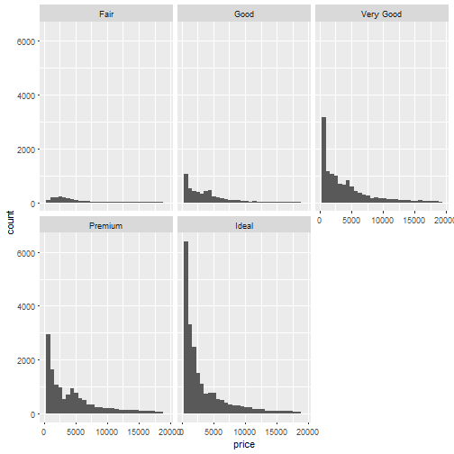

```r
diamonds$cut[which.max(diamonds$price)]
```

```
## [1] Premium
## Levels: Fair < Good < Very Good < Premium < Ideal
```

```r
diamonds$cut[which.min(diamonds$price)]
```

```
## [1] Ideal
## Levels: Fair < Good < Very Good < Premium < Ideal
```

```r
by(diamonds$price, diamonds$cut, summary)
```

```
## diamonds$cut: Fair
##    Min. 1st Qu.  Median    Mean 3rd Qu.    Max. 
##     337    2050    3282    4359    5206   18570 
## -------------------------------------------------------- 
## diamonds$cut: Good
##    Min. 1st Qu.  Median    Mean 3rd Qu.    Max. 
##     327    1145    3050    3929    5028   18790 
## -------------------------------------------------------- 
## diamonds$cut: Very Good
##    Min. 1st Qu.  Median    Mean 3rd Qu.    Max. 
##     336     912    2648    3982    5373   18820 
## -------------------------------------------------------- 
## diamonds$cut: Premium
##    Min. 1st Qu.  Median    Mean 3rd Qu.    Max. 
##     326    1046    3185    4584    6296   18820 
## -------------------------------------------------------- 
## diamonds$cut: Ideal
##    Min. 1st Qu.  Median    Mean 3rd Qu.    Max. 
##     326     878    1810    3458    4678   18810
```
we looked at the summary statistics for diamond price by cut. If we look at the output table, the the median and quartiles are reasonably close to each other.This means the distributions should be somewhat similar, but the histograms we created don't show that.The 'Fair' and 'Good' diamonds appear to have different distributions compared to the better cut diamonds. They seem somewhat uniform on the left with long tails on the right. So, we are going to fixed the scaled.

#Scales and Multiple Histograms:
add a parameter to facet_wrap so that the y-axis in the histograms is not fixed. You want the y-axis to be different for each histogram.


```r
qplot(x = price, data = diamonds) + 
  facet_wrap(~cut, scales = "free")
```

```
## `stat_bin()` using `bins = 30`. Pick better value with `binwidth`.
```

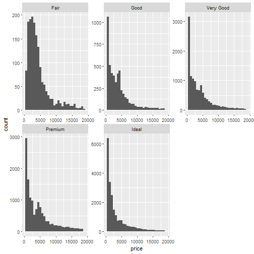

# Price per Carat by Cut:
Create a histogram of price per carat and facet it by cut.
Adjust the bin width and transform the scale of the x-axis using log10.


```r
qplot(x = log10(price/carat+1), data = diamonds, binwidth = 0.3)+
  facet_wrap(~cut, scales = "free")
```

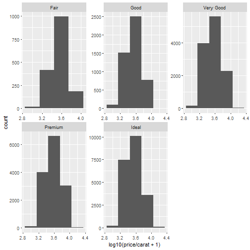
# Price Box Plots:
Investigate the price of diamonds using box plots, numerical summaries, and one of the following categorical variables: cut, clarity, or color.


```r
by(diamonds$price, diamonds$cut, summary)
```

```
## diamonds$cut: Fair
##    Min. 1st Qu.  Median    Mean 3rd Qu.    Max. 
##     337    2050    3282    4359    5206   18570 
## -------------------------------------------------------- 
## diamonds$cut: Good
##    Min. 1st Qu.  Median    Mean 3rd Qu.    Max. 
##     327    1145    3050    3929    5028   18790 
## -------------------------------------------------------- 
## diamonds$cut: Very Good
##    Min. 1st Qu.  Median    Mean 3rd Qu.    Max. 
##     336     912    2648    3982    5373   18820 
## -------------------------------------------------------- 
## diamonds$cut: Premium
##    Min. 1st Qu.  Median    Mean 3rd Qu.    Max. 
##     326    1046    3185    4584    6296   18820 
## -------------------------------------------------------- 
## diamonds$cut: Ideal
##    Min. 1st Qu.  Median    Mean 3rd Qu.    Max. 
##     326     878    1810    3458    4678   18810
```

```r
by(diamonds$price, diamonds$clarity, summary)
```

```
## diamonds$clarity: I1
##    Min. 1st Qu.  Median    Mean 3rd Qu.    Max. 
##     345    2080    3344    3924    5161   18530 
## -------------------------------------------------------- 
## diamonds$clarity: SI2
##    Min. 1st Qu.  Median    Mean 3rd Qu.    Max. 
##     326    2264    4072    5063    5777   18800 
## -------------------------------------------------------- 
## diamonds$clarity: SI1
##    Min. 1st Qu.  Median    Mean 3rd Qu.    Max. 
##     326    1089    2822    3996    5250   18820 
## -------------------------------------------------------- 
## diamonds$clarity: VS2
##    Min. 1st Qu.  Median    Mean 3rd Qu.    Max. 
##     334     900    2054    3925    6024   18820 
## -------------------------------------------------------- 
## diamonds$clarity: VS1
##    Min. 1st Qu.  Median    Mean 3rd Qu.    Max. 
##     327     876    2005    3839    6023   18800 
## -------------------------------------------------------- 
## diamonds$clarity: VVS2
##    Min. 1st Qu.  Median    Mean 3rd Qu.    Max. 
##   336.0   794.2  1311.0  3284.0  3638.0 18770.0 
## -------------------------------------------------------- 
## diamonds$clarity: VVS1
##    Min. 1st Qu.  Median    Mean 3rd Qu.    Max. 
##     336     816    1093    2523    2379   18780 
## -------------------------------------------------------- 
## diamonds$clarity: IF
##    Min. 1st Qu.  Median    Mean 3rd Qu.    Max. 
##     369     895    1080    2865    2388   18810
```

```r
by(diamonds$price, diamonds$color, summary)
```

```
## diamonds$color: D
##    Min. 1st Qu.  Median    Mean 3rd Qu.    Max. 
##     357     911    1838    3170    4214   18690 
## -------------------------------------------------------- 
## diamonds$color: E
##    Min. 1st Qu.  Median    Mean 3rd Qu.    Max. 
##     326     882    1739    3077    4003   18730 
## -------------------------------------------------------- 
## diamonds$color: F
##    Min. 1st Qu.  Median    Mean 3rd Qu.    Max. 
##     342     982    2344    3725    4868   18790 
## -------------------------------------------------------- 
## diamonds$color: G
##    Min. 1st Qu.  Median    Mean 3rd Qu.    Max. 
##     354     931    2242    3999    6048   18820 
## -------------------------------------------------------- 
## diamonds$color: H
##    Min. 1st Qu.  Median    Mean 3rd Qu.    Max. 
##     337     984    3460    4487    5980   18800 
## -------------------------------------------------------- 
## diamonds$color: I
##    Min. 1st Qu.  Median    Mean 3rd Qu.    Max. 
##     334    1120    3730    5092    7202   18820 
## -------------------------------------------------------- 
## diamonds$color: J
##    Min. 1st Qu.  Median    Mean 3rd Qu.    Max. 
##     335    1860    4234    5324    7695   18710
```

```r
qplot(x = cut, y = price, data = diamonds, geom = 'boxplot')
```

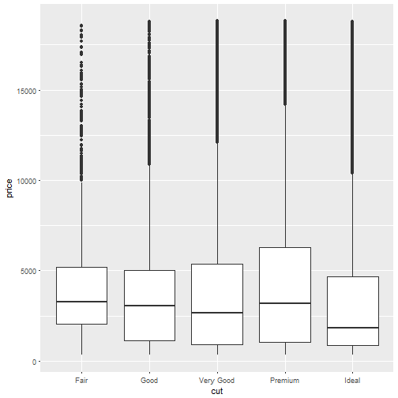

```r
qplot(x = clarity, y = price, data = diamonds, geom = 'boxplot')
```

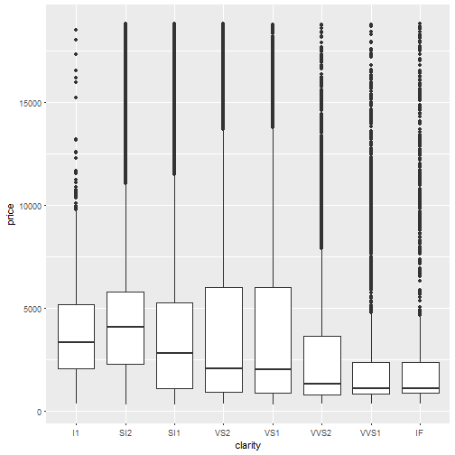

```r
qplot(x = color, y = price, data = diamonds, geom = 'boxplot')
```

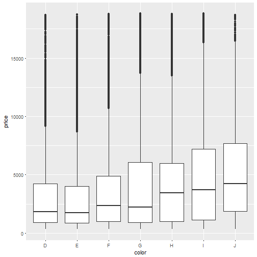

# Interquartile Range - IQR
what is the price range for the middle 50% of diamonds with color D? what is the price range for the middle 50% of diamonds with color J? what is the IQR for the diamonds with best color? what is the IQR for the diamonds with worst color?


```r
summary(diamonds$price[diamonds$color == "D"])
```

```
##    Min. 1st Qu.  Median    Mean 3rd Qu.    Max. 
##     357     911    1838    3170    4214   18690
```

```r
summary(diamonds$price[diamonds$color == "J"])
```

```
##    Min. 1st Qu.  Median    Mean 3rd Qu.    Max. 
##     335    1860    4234    5324    7695   18710
```

```r
IQR(diamonds$price[diamonds$color == "D"])
```

```
## [1] 3302.5
```

```r
IQR(diamonds$price[diamonds$color == "J"])
```

```
## [1] 5834.5
```

#Price per Carat Box Plots by Color:
Investigate the price per carat of diamonds across the different colors of diamonds using boxplots.


```r
qplot(x = color, y = price/carat, data = diamonds, geom = 'boxplot')+
    coord_cartesian(ylim = c(0,6000))
```

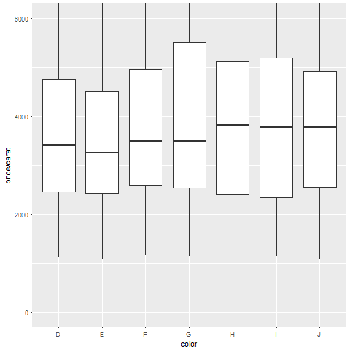
# Carat Frequency Polygon:

investigate the weight of the diamonds using frequency polygon. what carat size has a count greater than 2000?


```r
qplot(x = carat, data = diamonds,binwidth = 0.1,
      geom = "freqpoly")+
  scale_x_continuous(limits = c(0,6), breaks = seq(0,6,0.1))
```

```
## Warning: Removed 2 rows containing missing values (geom_path).
```

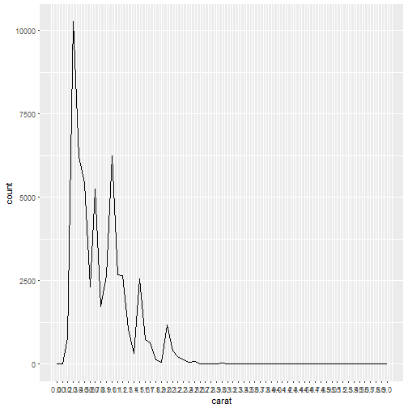

```r
table(round(diamonds$carat,1))
```

```
## 
##  0.2  0.3  0.4  0.5  0.6  0.7  0.8  0.9    1  1.1  1.2  1.3  1.4  1.5  1.6 
##  785 9606 6898 4921 2824 5000 1974 2591 5962 3048 2651  986  402 2432  862 
##  1.7  1.8  1.9    2  2.1  2.2  2.3  2.4  2.5  2.6  2.7  2.8    3  3.1  3.2 
##  581  190   54 1176  407  225  128   72   85   21   14    5   26    1    2 
##  3.4  3.5  3.6  3.7    4  4.1  4.5    5 
##    1    2    1    1    3    1    1    1
```


```r
require(knitr) # required for knitting from rmd to md
require(markdown) # required for md to html 
knit('Lesson3CaseStudy.rmd', 'Lesson3CaseStudy.md') # creates md file
```

```
## 
## 
## processing file: Lesson3CaseStudy.rmd
```

```
## Error in parse_block(g[-1], g[1], params.src): duplicate label 'setup'
```

```r
markdownToHTML('Lesson3CaseStudy.md', 'Lesson3CaseStudy.html') # creates html file
```

```
## Warning in readLines(con): cannot open file 'Lesson3CaseStudy.md': No such
## file or directory
```

```
## Error in readLines(con): cannot open the connection
```

```r
browseURL(paste('file://', file.path(getwd(),'Lesson3CaseStudy.html'), sep='')) 
```

